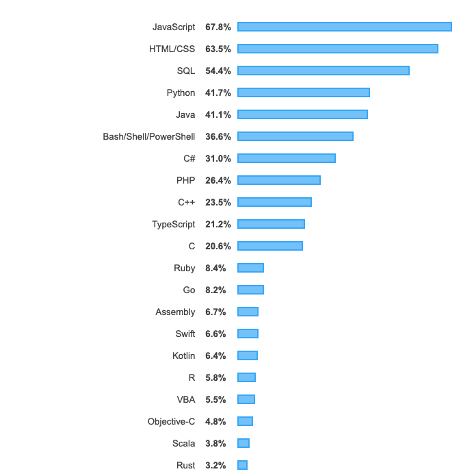
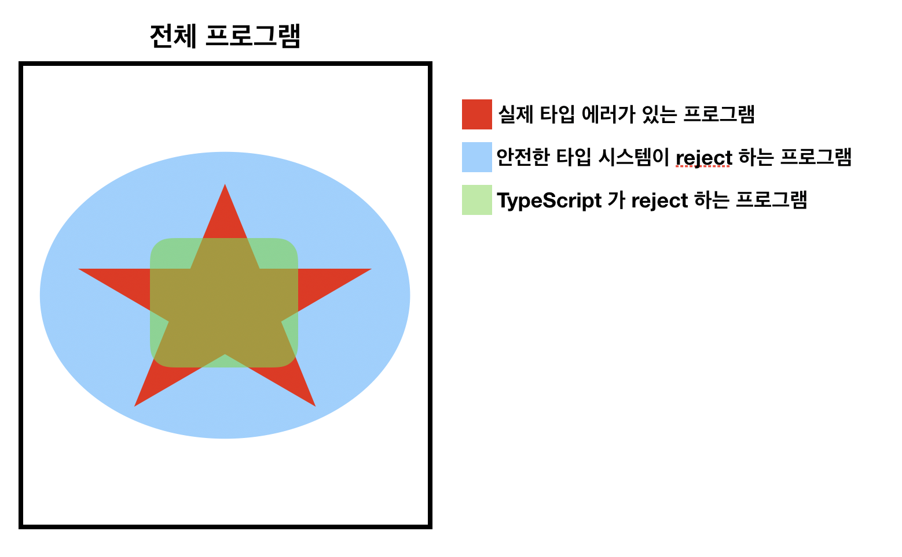

# TypeScript 에 대한 나의 생각

TypeScript Official Spec : https://github.com/microsoft/TypeScript/blob/master/doc/spec.md

- 작성자 : h2oche (h2oche@kaist.ac.kr)
- 작성일 : 2020.3.3
- 최근 수정일 : 2020.3.8

## TypeScript Playground(놀이터)

```
npm install -g gulp-cli
npm install
gulp
# [14:49:12] Starting 'compile'...
# [14:49:12] Finished 'compile' after 6.85 ms

node dist/main.js
```

src/main.ts 로 작성된 코드가 TypeScript 컴파일러를 통해 컴파일 되어서 dist/main.js 에 저장됨.

## 서론

원래는 TypeScript 의 타입 규칙을 요약하는 문서를 작성을 하려했다. 그런데 TypeScript에 대한 글을 쓰려다 보니 JavaScript 에 타입 시스템을 도입한다는 것이 어떤 의미인가에 대해 생각해보게 되었고, 몇 개월이라는 짧은 시간동안 프로그래밍 언어라는 학문을 공부하면서 받아들이게 된 타입 시스템에 대한 내용을 같이 정리해보는 것이 좋겠다는 생각이 들어 이런저런 살을 붙이게 되었다. 개요는 아래와 같다.

- 사람들은 왜 TypeScript 를 사용할까?
- 타입, 타입 시스템, 타입 안정성(Type Soundness)
- TypeScript 의 타입 불안정성과 의미
- TypeScript 의 타입 규칙을 이해할 때 도움이 될만한 배경 지식 + 레퍼런스
- 결론

## 사람들은 왜 TypeScript 를 사용할까?

본격적인 TypeScript 이야기를 하기 전에 *JavaScript 의 팬덤은 어떤 언어적 특성에서 기인할까?* 를 논의해보고 싶었다. 사실 JavaScript 인기의 근본적인 원인은 언어적 특성에서부터 기원한 것이 아니라 IT 산업에서 웹의 지위가 높아짐에 따라 편승한 면이 많다고 생각한다. 모든 브라우저에서 사용되는 스크립트 언어라는 신분이 없었다면, JavaScript 가 지금처럼 대중화 될 수 있었을까? 음... 아마 힘들었을 것이라고 생각한다.

하지만 매력이 없는 무색무취의 언어였다면 JavaScript 는 그저 브라우저에서 사용되는 스크립트 언어에서 발전이 멈췄을 것이고, 시대가 흐름에 따라 그 자리 역시 괜찮은 디자인을 가진 다른 언어에게 빼앗겼을 확률이 높다. 또한, 개발자들이 공들여서 CoffeeScript, Flow, TypeScript 와 같은 아류작(?) 들을 만들지도 않았을 것이고, 크로스 플랫폼 환경에서 만국 공통어로 자리 잡히는 일도 발생하지 않았을 것이다. 사람들이 왜 TypeScript 를 사용하는지를 이해하기 위해 **1. 우선 JavaScript 의 인기**를 언어적 특성 관점에서 파악하고 **2. TypeScript 가 어떤 한계를 보완하고 있는지**에 대해 생각해보았다.

### JavaScript 의 인기 - 언어적 특성 관점



2019 년 stackoverflow 에서 선정한 Most Popular Technologies [출처링크](https://insights.stackoverflow.com/survey/2019#most-popular-technologies) {: .text-center}

프로그래밍 언어의 특성은 논리적인 특성과 시스템적인 특성으로 구분지어 생각할 수 있다. 논리적인 특성은 사람의 머릿 속에 있는 생각이 어떻게 코드로 표현이 되는지에 대한 부분이고, 시스템적인 특성은 사람이 작성한 코드가 여러 연산 과정을 거쳐 어떻게 실제 컴퓨터의 동작에 도달하는지에 대한 부분이다. JavaScript 가 개발자에게 매력적인 언어인 이유 역시 논리적인 특성과 시스템적인 특성으로 구분이 되는데, 이 글에서 나의 초점은 논리적인 특성에 맞춰져 있다.

JavaScript 의 가장 큰 논리적 장점은 개발자의 머릿 속에서 구현하고 싶은 프로그램이 빠르게 프로토타이핑 된다는 것이고, 이런 특징은 JavaScript 가 dynamic 언어라는 것에서 기원한다. 더 이야기 하기 전에 이 글에서 프로그래밍 언어가 dynamic, static 하다는 것이 무엇인지에 대한 합의가 이루어져야 할 것 같다. 나는 dynamic, static 과 같은 용어들이 처음부터 존재한 것이 아니라 현상에서부터 파생된 단어들이라고 추측했고, 따라서 사람마다 이에 대한 해석이 달라질 수 있기 때문에 잠시 짚고 넘어가야할 부분이라고 생각했다. 구글링을 통해 개발자들의 상식에 가장 가깝다고 생각되는 것으로 프로그래밍 언어에서의 static, dynamic 에 대한 정의를 해 보았다. 엄밀한 정의는 아니지만 대충 무슨 의미인지는 충분히 전달되었을 것으로 기대한다. [참고링크](https://stackoverflow.com/questions/1517582/what-is-the-difference-between-statically-typed-and-dynamically-typed-languages)

- static type checking : 컴파일 타임에서 소스 코드를 보고 타입 검사를 하여 잘못된 표현식을 찾아내는 것
- static 언어 (statically typed language) : static type checking 을 사용하며 개발자에게 명시적인 타입 annotation 을 요구하는 언어 (C 계열, Java, Scala)
- dynamic type checking : 런타임에서 연산을 수행할 때 타입 검사를 하여 잘못된 연산을 방지하는 것
- dynamic 언어 (dynamically typed langauge) : dynamic type checking 을 사용하며 명시적인 타입 annotation이 존재하지 않는 언어 (JavaScript, Python, Ruby, PHP)

개발자들이 JavaScript 로 프로그래밍을 하면 타입, 메모리 등과 같이 실제 구현하고 싶은 로직과는 관계가 없는 많은 부분들을 생략할 수 있다. 또한, **1. 프로그램의 표현식을 구성하는 기본적인 문법이 다른 언어와 비교해 봤을 때 굉장히 단순하다는 점 2. 함수형 언어의 높은 표현력을 사용할 수 있다는 점 3. JSON 이라는 강력한 표현력 및 범용성을 가진 데이터 구조가 기본 데이터 구조라는 점** 역시 JavaScript 의 논리적 장점을 구성하는 중요한 요소라고 생각한다. 결국, 프로그래밍을 한다는 것은 사람이 컴퓨터에게 시키고 싶은 일을 프로그래밍 언어라는 컴퓨터가 알아들을 수 있는 형식으로 작성하는 것이고, "사람이 만들고 싶은 로직"이 프로그램이라는 결과물로 쉽게 표현이 된다는 것은 굉장한 장점이라고 생각한다.

사실 시스템적 특성에도 흥미로운 부분이 많다. 다양한 플랫폼(web, app, server, desktop)에서 사용할 수 있는 생태계가 갖추어져 있는 언어라는 점(범용성이 높다), 프로그램을 실행하는 메인 엔트리가 단일 스레드 기반의 이벤트 루프이고, 비동기 작업을 통한 자연스러운 동시성을 지원한다는 점 역시 중요한 시스템적 특성이지만, 이 글에서 논의는 언어를 구성하는 문법(표현식)과 의미(표현식의 해석)에 집중하고 싶었기 때문에 추가적인 사족을 달지 않았다.

### JavaScript 의 한계와 TypeScript

하지만, JavaScript 에는 **"프로젝트가 진행될수록 JavaScript만으로 작성된 프로그램이 개발자의 의도대로 동작하는 지를 확인하기 힘들다"** 라는 명확한 한계가 존재한다. 내가 작성한 프로그램이 무슨 의미인지 파악하기 힘들다는 것은 개발자에게 수많은 비용 낭비를 일으키는 심각한 단점이고, 이는 ECMAScript 라는 JavaScript 에 대한 언어 표준이 존재하고 매년 발전되고 있음에도 불구하고 CoffeeScript, Flow, TypeScript 와 같은 변종들이 탄생하며 개발자들에게 환영받는 이유이다. *왜 JavaScript 로 작성한 프로그램에 버그가 많은지*를 생각해 보았고 이에 대한 원인은 크게 **1. JavaScript 라는 언어 자체의 요상하고 독특한 의미 구조 2. static type checking 의 부재** 에서 찾을 수 있다는 생각이 들었다.

이 단락에서 이야기 하고 싶은 TypeScript 의 등장은 2번 원인으로부터 나왔기 때문에, 1번 원인은 간단히 목록으로 나열하는 선에서 이야기를 마치려고 한다. 

- 다른 언어에서 사용되는 class 기반의 OOP 가 아닌, prototype 기반의 OOP 를 가지고 있다는 점
- 함수와 문맥 파악이 힘들다는 점(this 라는 키워드가 함수 호출 방법에 따라 달라짐)
- 비동기 함수 호출과 독특한 런타임
- 이 외에도 값이 연산 과정에서 시시때때로 바뀐다는 점 등등

사실 이 문제는 개인적으로 JavaScript 언어 설계상의 허점보다는 다른 언어를 사용하던 개발자들이 처음에 만만해 보이던 JavaScript 가 사실 독특하고 낯선 의미 구조를 가지고 있다는 것을 발견해 나가며 받는 느낌적인 느낌에 가깝다고 생각하고, 많은 부분들이 ECMAScript의 스펙 발전에 따라 해소되고 있다고 생각한다.

2번 원인은 조금 더 근본적이고 JavaScript 자체의 발전만으로 해결될 수 없다. 이러한 문제는 *dynamic 언어의 특성*에서부터 기원하였고, TypeScript의 등장 배경이 되었다. dynamic 언어의 특성상 개발자들에게 type annotation 을 전혀 요구하지 않음과 동시에 static type checking 이라는 개념 역시 존재하지 않는다. static type system 은 프로그램에 잘못된 부분이 있나 없나를 검사해 주는 일종의 프로그램 분석 기법으로 생각할 수 있고, 이런 기법을 사용하지 않는 언어로 작성된 프로그램에 버그가 있을 확률이 높다는 것은 자명하다. TypeScript 는 이런 단점들을 보완하기 위해 JavaScript 위에 static type checking 을 얹었다. 거시적인 관점에서 살펴보면 dynamic 언어의 생산성과 static 언어의 정확성 사이에 우열을 가릴 수 없는 일종의 trade-off 관계가 존재하고, JavaScript 라는 언어의 생산성을 희생하면서 static type checking 을 통해 프로그램에 일정 수준의 정확성을 불어 넣어주는 것이 TypeScript 의 존재 의의라고 볼 수 있다. 순수한 JavaScript 로 야심차게 프로젝트를 시작한 나를 비롯한 많은 사람들이 리팩토링 단계에서 TypeScript 를 찾게 되는 이유도 이와 같은 trade-off 에서 정확성을 원하는 것이라는 것이 내 추측이다.

계속 타입, 타입 시스템과 같은 용어를 사용하였는데, 이런 친숙해 보이는 용어들 뒤에는 사실 프로그래밍 언어 분야의 (1)어렵고 (2)수학적이고 (3)학문적인 배경들이 존재한다. 이런 이론적 배경들이 전형적인 개발에 있어서 꼭 필요한가?를 물었을 때, "그렇다"라고 대답할 수 없다. 하지만 TypeScript 를 실제 프로젝트에서 사용할 단계까지 도달한 사람들에게 "내가 TypeScript 를 사용하는 것은 어떤 의미인가?", 조금 더 일반화하여 "타입 시스템을 사용하는 것이 무슨 의미일까?" 는 한 번쯤 짚고 넘어갈만한 흥미로운 주제라고 생각한다. 또한, 개인적으로 타입과 타입 시스템에 대한 이론적인 배경을 접한 이후, 프로그래밍에 대한 전반적인 이해도와 숙련도가 높아졌다고 느껴 이 부분을 고수준에서 요약 및 정리해보고 싶었다.

## 타입, 타입 시스템, 타입 안정성(Type Soundness)

*프로그래밍에서 타입이 가지는 의미는 무엇일까? 프로그래밍 언어에 타입 시스템을 도입함으로써 얻을 수 있는 효과는 무엇일까?*

프로그래밍 언어에 타입 시스템이 있음으로써 개발자가 얻을 수 있는 효과는 크게

1. 높은 수준의 추상화가 필요할 때 버팀목이 되어준다.
2. 자연스럽게 프로그램에 구조가 생기고, 문서화 하는 효과가 생긴다.
3. 프로그램에 존재하는 타입 에러를 런타임 전에 검출하여 디버깅 할 수 있다.

정도인 것 같다. 타입 시스템을 사용하는 것에서부터 어떻게 이러한 효과들이 도출 되는가에 대한 missing link 를 내가 공부하며 받아들인 내용을 바탕으로 설명하고자 노력하였다.

이 단락의 내용을 3줄 요약하자면 다음과 같다.

- 타입을 사용한다 -> 프로그램에 논리 구조를 추가한다
- 정적 타입 시스템을 사용한다 -> 논리 구조에 따라 잘못된 표현식을 포함한 프로그램을 런타임 이전에 찾아낸다.
- 타입 시스템의 타입 안정성이 증명되었다 -> 타입 시스템을 통과한 프로그램은 런타임에서 타입 에러가 **절대** 발생하지 않는다.

### 타입

[추천 링크](https://www.codegram.com/blog/becoming-a-logician-with-typescript/)

*타입은 프로그램 표현식에 대한 논리적인 명제이다*

```
"타입이란 무엇인가요?"
"int, string 같은 거요"
"int, string 같은게 뭐에요?"
"잘 모르겠는데요? 그게 중요한가요?"
```

타입이 무엇인가에 대해 1년 전의 나에게 물어본다면 아마 위와 같은 대화가 이루어 졌을 것 같다. 평소에 프로그래밍을 하면서 타입이라는 것을 적기도하고, 문서 편집기와 터미널이 뱉어내는 타입 에러 관련 오류 메세지를 보며 정신적인 고통도 받아보았지만, 타입이 뭔지에 대해는 한번도 고민해 본 적이 없었다. 내 무의식 속에서는 아마 *값들에 대한 집합* 정도로 받아들이지 않았을까 싶다. 하지만 타입을 단순히 값들에 대한 집합이라고 얘기하기에는 뭔가 부족함이 느껴진다. 함수에 타입을 붙이는 것은 무슨 의미일까? 제너릭(parametric polymorphism)은? 값에 대한 집합이라는 개념으로는 이러한 것들이 잘 설명되지 않는다.

프로그래밍 언어와 프로그램 검증에 대한 공부를 통해 타입의 의미에 대해 조금이나마 파악할 수 있었다. 현재 나는 타입이 *프로그램에 존재하는 표현식에 대한 논리적인 명제*라고 생각을 하고, 이와 더불어 *프로그램의 표현식은 타입이 주장하는 명제에 대한 증명* 이라고 것을 받아들일 수 있다. 내가 처음 타입 이론책을 공부하며 이 문장을 접했을 때는 "이게 무슨 뜬구름 잡는 소리야?" 라고 생각헀고, 이를 이해하지 못한 채 페이지를 넘겼다. 하지만, Coq 을 사용해보고, 프로그램 검증을 공부할 때 머릿속 안개가 사라지며 *값들에 대한 집합* 이라는 내 첫 무의식 속 관념이 *표현식에 대한 논리적인 명제* 라는 조금 더 일반화된 관념으로 바뀜과 동시에 표현가능한 의식의 영역으로 떠오르는 색다른 경험을 할 수 있었다. 또한, 기존의 수학에서 정립된 논리 체계들과 CS에서 탄생한 타입 이론이 사실 동일한 것에 대한 다른 표현이라는 것을 받아들일 수 있게 되었다.

이에 대한 자세한 이야기는 [Curry-Howard correspondence](https://www.google.com/search?q=curry+howard+correspondence&rlz=1C5CHFA_enKR879KR879&oq=curry+howard+correspondence&aqs=chrome..69i57.5577j0j7&sourceid=chrome&ie=UTF-8) 라는 키워드를 통해 검색하면 훨씬 양질의 자료를 찾아 볼 수 있고, 그 중 [TypeScript 로 설명한 링크](https://www.codegram.com/blog/becoming-a-logician-with-typescript/)도 존재한다. 조금 더 관심이 생겼다면 [Software Foundation](https://softwarefoundations.cis.upenn.edu/) 을 공부해 보기를 추천한다.

결국, 타입을 사용한다는 것은 프로그램에 논리 구조를 추가한다는 것과 동일한 의미이다. 높은 수준의 복잡한 추상화가 필요할 때, 타입이 버팀목처럼 작용하는 이유와 자연스럽게 프로그램에 구조가 생기고 문서화 되는 효과가 생기는 이유가 여기에 있다.

### 타입 시스템, 타입 안정성



정적 타입 시스템의 핵심은 개발자가 작성한 프로그램에 타입 에러가 있는지 없는지(타입으로 표현된 프로그램의 논리가 정당한지)를 프로그램을 실행하지 않고도 안전하게 판별할 수 있다는 점에 있다. 타입 시스템이 어떤 역할을 하는지 조금 더 잘 파악하기 위해서는 "안전한" 이 어떤 의미인지를 조금 더 자세히 살펴봐야한다.

특정 프로그래밍 언어로 만들어진 프로그램들의 세계를 상상해보자. 문법 오류가 없는 모든 프로그램들은 분명 위 그림 속 네모 안 어딘가에 점 하나로 존재할 것이고 "빨간색 삐쭉빼쭉한 별로 표현된(실제 타입 에러가 있는) 프로그램 영역 안에 있나요?" 라고 질문했을 때 나올 수 있는 대답은 "네", "아니요" 둘 밖에 없을 것이다. 타입 시스템은 내 프로그램이 파란색 타원 안에 있으면 타입 에러가 있다고 판단한다. 위에서 "안전한" 이라고 표현한 것이 이런 의미이다.

안전한 타입 시스템을 가지고 있는 프로그래밍 언어로 작성된 프로그램이 타입 시스템을 통과했다는 것은 파란색 영역 바깥에 프로그램의 점이 존재한다는 것이고, *그 프로그램에 **절대** 타입 에러가 존재할 수 없다는 것과 동일한 뜻이다.* 반대로 프로그램이 타입 시스템을 통과하지 못했다는 것은 프로그램이 파란색 영역 안에 있다는 의미이고, 실제로는 타입 에러가 없는 프로그램도 타입 검사를 통과하지 못하는 경우가 발생한다. 따라서 안전한 타입 시스템이 실용적이기 위해서는 파란색 영역이 충분히 빨간색으로 표현된 실제 타입 에러가 있는 영역에 가까워야 할 것이고, 정확하게 빨간색 영역에 일치하는 것이 제일 이상적일 것이다.

하지만, 안타깝게도 이런 이상적인 타입 시스템은 존재하지 않는다는 것이 수학적으로 증명되었다. 이에 대한 증명의 핵심 아이디어는 이상적인 타입 시스템을 설계하려는 문제를 풀 수 있으면 [정지 문제(Halting Problem)](https://ko.wikipedia.org/wiki/%EC%A0%95%EC%A7%80_%EB%AC%B8%EC%A0%9C)역시 풀 수 있다는 것이고, [환원(reduction)](https://ko.wikipedia.org/wiki/%ED%99%98%EC%82%B0_(%EB%B3%B5%EC%9E%A1%EB%8F%84))이라는 테크닉이 사용된다. 사실 타입 시스템의 목표인 "타입 에러가 있는 프로그램의 판별" 뿐만 아니라 프로그램의 의미를 통해 프로그램을 정확하고 안전하게 판별하는 알고리즘은 존재할 수 없다는 일반적인 사실 역시 증명이 되었고, 타입 시스템 뿐만 아니라 모든 프로그램 분석 기법은 안전성(soundness)과 정확성(completeness) 사이에 하나를 희생할 수 밖에 없다.

## TypeScript 의 타입 불안정성과 의미

하지만 위 그림에서 볼 수 있듯이 TypeScript 의 타입 시스템은 엄밀한 인전성을 보장하지 않는다. 이 것을 다시 생각해보면 TypeScript 로 작성된 프로그램이 타입 검사를 통과했더라도 여전히 타입 에러가 발생할 수 있다는 것이고, "불안정한 타입 시스템이 무슨 의미가 있는거냐?" 라는 의문이 자연스럽게 생기게 되었고, 실제로 이에 대한 의문을 가지고 있는 개발자들도 많은 것 같다([읽어볼만한 이슈](https://github.com/microsoft/TypeScript/issues/9825)). 하지만 학문적인 의미가 설사 없다 하더라도 TypeScript의 이용 가치는 위에서 언급한 타입 시스템의 효과들을 생각해 보았을 때 매우 높다고 생각한다. [TypeScript 의 design goal](https://github.com/Microsoft/TypeScript/wiki/TypeScript-Design-Goals) 을 살펴보면 TypeScript 를 제작한 사람들 역시 타입 규칙을 조금 더 다듬어 안전한 타입 시스템을 만들기보다 어떻게 하면 타입 시스템이 조금 더 실용적으로 사용될 수 있을지에 대해 고민하고있고, 앞으로도 계속 이러한 방향으로 발전시켜 나갈 것이라고 한다. 이는 결국 개발자들이 원하는 것은 이론적으로 아름다운 타입 시스템이 아니라 불완벽한 실용적인 타입 시스템이라는 TypeScript 제작자의 신념으로 볼 수도 있을 것 같고, 적어도 JavaScript 생태계 안에서는 맞는 말이라고 생각한다. 

### TypeScript 의 불안정성 예시

공식 문서를 참고하며 TypeScript 의 불안정성이 무슨 이유로 발생하는지를 각각 사례와 함께 정리해 보았다. 아마 찾아보면 더 많이 있을 것 같은데, 현재까지 생각해 본 것은 아래 3개의 시나리오이다. 여유가 되면 조금 더 찾아서 업데이트를 해 볼 예정이다.

- **Array 의 covariance**

```javascript
/* Example 1 : Array */
let arr: Array<string | number>;
let arr2: Array<string> = [ 'foo', 'bar' ];
arr = arr2;
arr.push( 3 );
arr2[ 2 ].toUpperCase(); /* TypeError: arr2[2].toUpperCase is not a function */

let arr3: Array<string | number> = [ 'foo', 3 ];
let arr4: Array<string> = arr3; /* Error: TypeScript: Compilation failed */
```

타입 안정성을 보장하는 타입 시스템에서 Array 는 invariant 하지만 TypeScript 에서 Array 는 covariant 하다. 

- **Function parameter 의 bivariance**

```javascript
class Example {
  foo ( maybe: number | undefined ) { }
  str ( str: string ) { }
  compare ( ex: Example ) { }
}

class Override extends Example {
  foo ( maybe: number ) {
    maybe.toFixed( 3 );
  } // Bad: should have error.
  str ( str: 'override' ) { } // Bad: should have error.
  compare ( ex: Override ) { } // Bad: should have error.
}

var objA: Override = new Override();
var objB: Example = objA;
objB.foo( undefined ); /* TypeError: Cannot read property 'toFixed' of undefined */
```

타입 안정성을 보장하는 타입 시스템에서 함수 서브타입을 정의할 때, 함수 parameter 는 contravariant 하다. 하지만, TypeScript 에서는 bivariant(covariant + contravariant)하다. Covariance, contravariance, bivariance, invariance 와 같은 용어들이 무슨 뜻인지는 [링크](https://medium.com/@thejameskyle/type-systems-covariance-contravariance-bivariance-and-invariance-explained-35f43d1110f8)를 보면 의미를 파악할 수 있다.

- **IO를 통해 fetch한 데이터**

```javascript
interface NoteObject {
  id: string;
  url: string;
}

let note:NoteObject = fetch_note_from_server(SERVER_ENDPOINT);
note.url.toUpperCase(); // TypeError 가 일어날 가능성이 있음
```

IO 를 통해 받은 데이터의 타입에 대한 안정성은 TypeScript 에서 전혀 보장을 하지 않는다. IO 에 대한 데이터 안정성을 위해서는 런타임에 타입 검사를 하는 메커니즘이 필요한데, 이 기능은 현재 TypeScript 에서 지원하지 않고, 앞으로도 지원할 생각은 없는 것 같다(TypeScript 의 Design Goal 은 JavaScript 런타임 동작을 전혀 바꾸지 않는 것이라고 한다). TypeScript 에서 정의한 타입을 런타임에서 검사하는 방법은 [추천링크](https://lorefnon.tech/2018/03/25/typescript-and-validations-at-runtime-boundaries/)를 추천한다.

### TypeScript 의 실용적 사례

마지막으로 TypeScript 를 사용해보며 내가 실용적이라고 생각했던 몇가지 사례를 정리해보았다. 이 부분 역시 TypeScript 를 조금씩 더 알아나가며 여유가 될 때 업데이트를 할 예정이다. 개인적으로는 TypeScript 에 굉장히 만족하고 있다.

- **Union, Enum 타입**

```javascript
type HTTPMethod = "GET" | "POST" | "PUT" | "DELETE";
function request(method: HTTPMethod, url: string) {}

request("GET", "server") /* Type Check */
request("GOOD", "server") /* Type Error */

enum Screens {
  LOGIN, MAIN, PROJECT
}
Screens.LOGIN
Screens.MAIN
```

TypeScript 의 union 타입을 사용해 다른 언어의 enum type 을 사용한 것과 비슷한 효과를 얻을 수 있다. 위와 같이 사용하는 방법외에 진짜 enum 키워드를 사용 할 수도 있다.

- **함수에 대한 옵션을 object 형태로 표현한 경우 + optional parameter**

```javascript
interface FileOpts {
  path: string;
  encoding: 'utf-8' | 'ascii' | 'bytes';
  type?: 'image' | 'pdf'
}
function readFile(opts: FileOpts):Promise<any> {
  ...
}
readFile({path: 'path', encoding: 'utf-8'}) /* Type Check */
readFile({path: 'path', encoding: 'utf-8', type: 'pdf'}) /* Type Check */
readFile({path: 'path', encoding: 'utf-8', type: 'hwp'}) /* Type Error */
readFile({path: 'path'}) /* Type Error */
readFile({bug: 'asdfasdfasdf'}) /* Type Error */
```

위와 같이 함수 옵션을 object 형태로 표현하는 것은 JavaScript 로 프로그래밍을 하며 흔히 발견할 수 있는 패턴임과 동시에 버그가 발생하는 주요 원인이다. TypeScript 를 사용하면 이런 버그를 상당부분 캐치할 수 있다. 또한, 자연스럽게 코드에 문서화가 된 효과를 경험할 수 있고, IDE에서 제공하는 자동 완성 기능의 열매를 맛볼 수 있다.

- **비동기 용법의 잘못된 사용 방지**

```javascript
function readFile ( path: string ): Promise<any> {
  return new Promise<string>( ( res, rej ) => { res( "hi" ) } );
}

let file = await readFile( "./index.js" );
file.toUpperCase() /* Type Check */

let file = readFile( "./index.js" );
file.toUpperCase() /* Type Error */

```

비동기 용법을 잘못 사용하는 것 역시 JavaScript 로 프로그래밍을 하면서 흔히 하게되는 실수이다. TypeScript 를 사용하면 이런 버그를 바로 발견할 수 있다.

- **strict null checks**

많은 JavaScript 버그는 null 과 undefined 으로 인해 발생한다. 이 옵션을 사용함으로써 null 을 완전히 생각하지 않고 프로그래밍을 할 수 있고, JavaScript 프로그래밍을 할 때, 좋은 습관이라고 생각한다.

- **생태계**

많은 유명 library 들이 TypeScript 를 통해 타입 정보를 제공한다. 또한, React 에서 사용하는 JSX 문법역시 잘 호환된다. 또한 [fp-ts](https://gcanti.github.io/fp-ts/) 라는 library 를 통해, Haskell, Scala 등의 함수형 프로그래밍을 할 때 자주 사용되는 Type 들 Option, Either, ... 등을 TypeScript 에서 사용할 수 있다.

## TypeScript 의 타입 규칙을 이해할 때 도움이 될만한 배경 지식 + 레퍼런스

TypeScript의 타입 시스템에는 프로그래밍 언어 분야에서 파생된 많은 아이디어들이 포함되어 있다. 이를 알고 있다면 TypeScript 의 타입 규칙을 한결 수월하게 읽을 수 있다고 생각한다. 나도 아직 모르는 부분이 많지만 지금까지 파악한 정도에서 키워드만 정리해 보았다. 또한, 좋았다고 생각되는 레퍼런스도 모아봤다. 이 부분 역시 여유가 될 때 업데이트를 해 볼 예정이다.

### 사용한 프로그래밍 분야의 아이디어

- union & intersection type
- generic(parametric polymorphism)
- structural subtyping
  - https://softwareengineering.stackexchange.com/questions/181154/type-systems-nominal-vs-structural-explicit-vs-implicit
  - https://softwareengineering.stackexchange.com/questions/259943/is-there-a-difference-between-duck-typing-and-structural-typing
  - https://stackoverflow.com/questions/4205130/what-is-duck-typing
- 그 외 굉장히 많은 기능이 있다. TypeScript 공식 문서의 advanced type 을 참고하면 많은 정보를 얻을 수 있다.

### 그 외 레퍼런스

- 기본 규칙에 대한 요약 : https://github.com/lakshaydulani/typescript-summary
  - 사실 이 글의 본 목적은 이런 정리를 하는 것이었는데..
- 고급 규칙에 대한 요약 : https://rinae.dev/posts/practical-advanced-typescript-summary
- TypeScript vs Flow 를 사용해본 후기 : https://www.slideshare.net/HeejongAhn/typescript-flow-81799404

## 결론

...